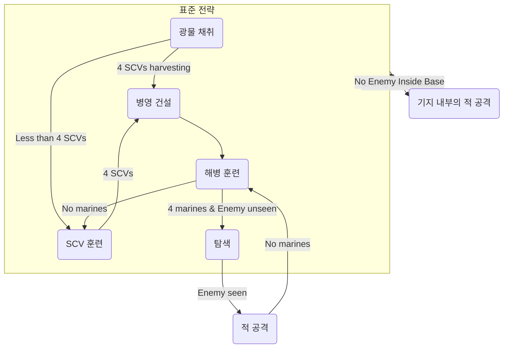
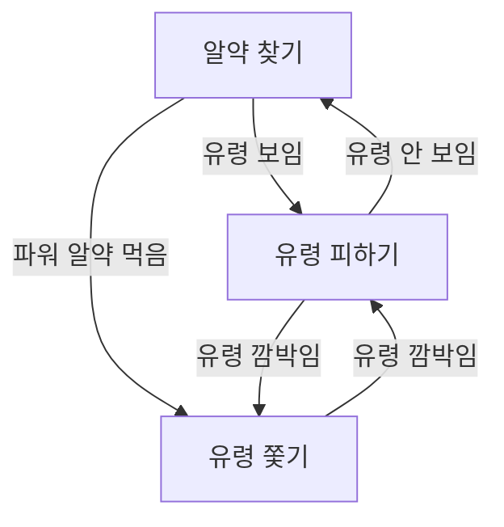

---

### **프로젝트 유형**

*   **데모**: 데모 시스템 + 데모 논문
*   **연구**: 참신성, 새로운 접근 방식 → 짧은 연구 논문
*   **경쟁**: 참가 + 경쟁 논문

### **과제 #1: 길 찾기**

*   RTS 게임에서 A\* 알고리즘을 구현하세요.
*   게임 엔진: S3 (Java → Python)
*   제출 기한: 9월 19일 (금) LMS를 통해 제출
*   제출 내용: 소스 코드, 설명 (1~2페이지), 짧은 동영상

### **담당 조교**

상연 박 (tkddus0421@gm.gist.ac.kr)

### **자기소개**

*   이 강좌를 수강한 이유는 무엇인가요?
*   프로젝트 계획이 있다면 무엇인가요?
*   어떤 종류의 게임을 하시거나 좋아하시나요?
*   그 외 궁금한 점이 있으신가요?
*   HyunJin Cho, Hamin Park, Jaeoh Hyeon의 기여에 감사드립니다.

### **실용 대 학술**

### **예시: 하프라이프 2 (Half Life 2)**

*   **알려진 정보**: 위치, 지도, 스트라이더 위치, 시간
*   **알려지지 않은 정보**: (없음, 게임 AI는 치트 사용 ☺)
*   **행동**: X 방향으로 돌기, X로 걷기, X로 달리기, X에게 발사, 애니메이션 X 재생

### **예시: RTS 게임**

*   **알려진 정보**: 플레이어 데이터, 탐색된 지형
*   **알려지지 않은 정보**: 탐색되지 않은 지형, 적 전략
*   **행동**: 병영 건설, 정제소 건설, 보급고 건설, 대기, 탐색 등

### **NPC 행동 담당자는 누구인가요?**

**게임 스튜디오**

### **유한 상태 기계 (Finite State Machines, FSMs)**

유한 상태 기계는 상태 목록, 전환 목록, 상태 코드로 구성됩니다.
*   `BUILD_BARRACKS`와 같은 상태 목록
*   전환 목록
*   상태 코드
*   **간단한 AI에 적합합니다.**
*   **복잡한 작업에는 관리하기 어려워집니다.**
*   **유지보수가 어렵습니다.**

#### **유한 상태 기계 (새로운 상태 추가)**

FSM을 "적이 우리 기지 안으로 들어오면 공격"하도록 변경하는 것은 FSM 내부에 또 다른 FSM을 포함하는 방식으로, 필요한 만큼 계층을 만들면 복잡성 문제를 어느 정도 완화할 수 있습니다.

**RTS 게임 NPC를 위한 FSM 예시 (계층화)**

### **Ms. Pac-Man을 위한 FSM**

Ms. Pac-Man을 위한 고수준의 단순화된 FSM은 세 가지 상태와 전환으로 구성될 수 있습니다. FSM은 설계, 구현, 시각화 및 디버깅이 매우 간단하다는 장점이 있습니다.

**설명:**
*   **알약 찾기 (Seek Pellets)**: Ms. Pac-Man은 이 상태에서 맵을 돌아다니며 일반 알약을 찾고 먹습니다. 유령이 시야에 들어오면 유령 피하기 상태로 전환되고, 파워 알약을 먹으면 유령 쫓기 상태로 전환됩니다.
*   **유령 피하기 (Evade Ghosts)**: Ms. Pac-Man은 이 상태에서 유령들에게서 벗어나기 위해 움직입니다. 일정 거리 내에 더 이상 유령이 보이지 않으면 다시 알약 찾기 상태로 돌아갑니다. 유령이 깜박이기 시작하면 유령 쫓기 상태로 전환됩니다.
*   **유령 쫓기 (Chase Ghosts)**: Ms. Pac-Man은 이 상태에서 파워 알약의 효과로 약해진 파란색 유령들을 쫓아먹습니다. 유령들이 깜박이기 시작하면 유령 피하기 상태로 전환됩니다.

### **의사결정 트리 (Decision Trees)**

*   **직관적입니다.**
*   **놓친 사례가 있는지 파악하는 데 도움이 됩니다.**
*   **구현하기 쉽습니다**: "종이와 연필" 기술로 문제를 생각한 다음 중첩된 `if-then-else` 문을 사용하는 데 사용할 수 있습니다. 또한 일반적인 방식으로 구현하고 게임 디자이너에게 그래픽 편집기를 제공할 수도 있습니다.

#### **의사결정 트리와 결합된 유한 상태 기계**

복잡한 FSM에서는 전환 조건이 복잡해질 수 있습니다. **각 상태는 다음에 어떤 상태로 전환할지 결정하기 위해 의사결정 트리를 가질 수 있습니다.**
예를 들어, 상태 S1에서 조건 C1이 충족되면 S2로, C2가 충족되면 S3로 전환하는 것과 같이, C1, C2가 복잡한 의사결정 트리가 될 수 있습니다.